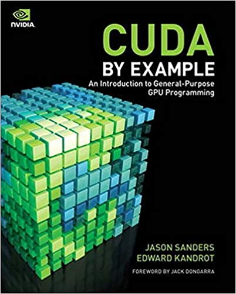

<h1>
 💅 
CUDA GPU ACCELERATION
 

</h1>

 

# 
CUDA_GPU

My journey through the gpu acceleration NVIDIA CUDA language

### Folders
| Directory name  | Content | Additional information |
| ------------- | ------------- |
| BEGINNER  | Tutorials, first basic projects | Following "CUDA by Example: An Introduction to General-Purpose GPU Programming" written by Jason Sanders |

